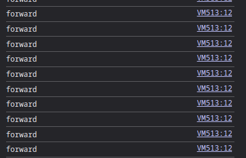

## Component Loader

#### Issues
1. components JS needs to ensure that the HTML is completely rendered before firing the JS logic. Absence of such check makes results in that the JS may get fired before the HTML is loaded which in turn causes the failure of DOM query lookup and then script execution stops. In order to achieve such control over the loaded components, you must have used ajax and custom event triggering to be able to fire your js after the HTML is rendered.
2. Why you didn't use AJAX ? You might have noticed many improvements if you did.

#### Enhancements
1. What if we want nested components structure ?
2. Components Fault Tolerance ?
3. Debugging is hard becuase js filenames are not showing up in the console but virtual references appear. One approach to solve it is to load the JS files as text with AJAX and appending a line with the `#sourceURL` directive at the end of every loaded script 

## Paths Resolution
#### Issues
1. Loader is loading all component relative to the `working dir` which is not static and causes loading issues if the project intallation is not the same as yours. One way to deal with that properly is to define some `ROOT_DIR` constant somewhere that every installer can modify easily and use it everywhere instead of using paths relative to the working dir (which is a floating environment)
2. You are using relative paths everywhere to load assets like images which won't work if the `COMPONENT_DIR` wasn't the root directory of localhost. There are many ways to solve this issue
   1. The ideal method is to allow introducing variables into the HTML components like other CDD frameworks(props in react, @input in angular). Such variable resolution is implemented in Arte-Client by doing something like that in the components: `{{IMAGES_DIR}}/image.png` and `IMAGES_DIR` is a global constant that is defined elsewhere
   2. When components are dynamically loaded, their current working directory becomes identical to the loader working directory which `index.html` in SPAs, so why not just load assets like that `assets/asset.ext` instead of `../assets/asset.ext` since the assets are already next to the loader which is index.html.
   3. The simplest solution is that if your system requires a certain setup or directory structure, document it so that we know how to install your program without problems.
3. Path errors are everywhere because my directory structure needs the project to be `localhost/project_name` instead of `localhost` directly. This invariant is not easy to handle and must be put into consideration in your future projects

## Fault Tolerance (Enhancement)
JS is not a type-strict language and this causes JS scripts to be more error-prone than other languages to the extent a keyword was added — which is `'use strict'` — to `ECMAScript` latest releases to improve it a little but it sucks though :D. To deal with that, you must make a little more effort in checking variables existence and stuff like that before accessing them. I sent the repo Arte-Client so that you get an insight about fault-tolerance and not to just use variables blindly. That's in case you want to improve your app robustness.